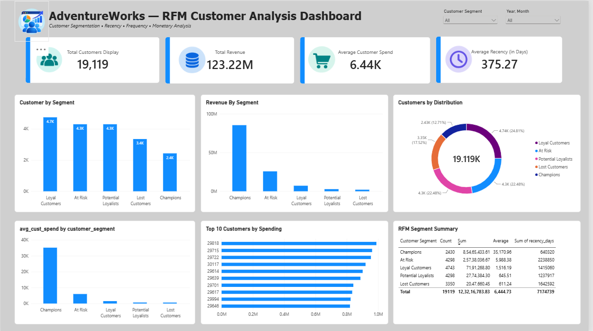

# AdventureWorks RFM Customer Analysis

## Project Overview

Customer segmentation and RFM (Recency, Frequency, Monetary) analysis using the AdventureWorks dataset.

The project analyzes customer purchasing behavior and segments customers based on their recency, purchase frequency, and monetary value.

## Tools Used

- PostgreSQL
- SQL
- Excel
- Power BI

## RFM Analysis

### Recency
Number of days since the customer's most recent purchase.

### Frequency
Number of orders placed by the customer.

### Monetary
Total amount spent by the customer.

## Customer Segmentation

Customers were segmented based on their RFM scores to identify groups such as:

- Champions
- Loyal Customers
- Potential Loyalists
- At Risk
- Lost Customers
- New Customers

## Dashboard

The Power BI dashboard provides:

- Total Customers
- Total Revenue
- Average Customer Spend
- Average Recency
- Customer Distribution by Segment
- Revenue by Segment
- Top Customers by Spending
- RFM Segment Summary

## Project Files

- `AdventureWorks_RFM.pbix` — Power BI dashboard
- `RFM_Analysis.sql` — SQL analysis and RFM calculations
- `README.md` — Project documentation

## Key Business Questions

- Who are the highest-value customers?
- Which customer segments generate the most revenue?
- How many customers are at risk of becoming inactive?
- Which customers have high purchase frequency?
- Which customer segments should receive targeted retention strategies?

## Dataset

AdventureWorks sample database.

## Dashboard Preview

